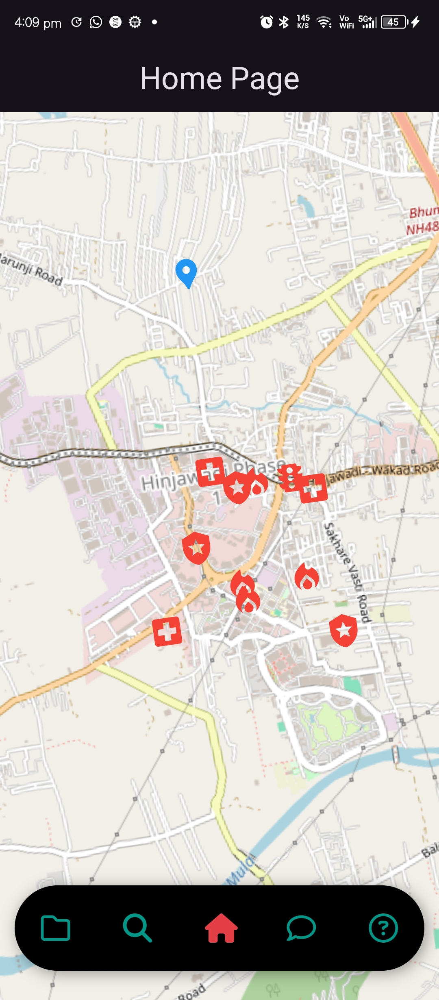
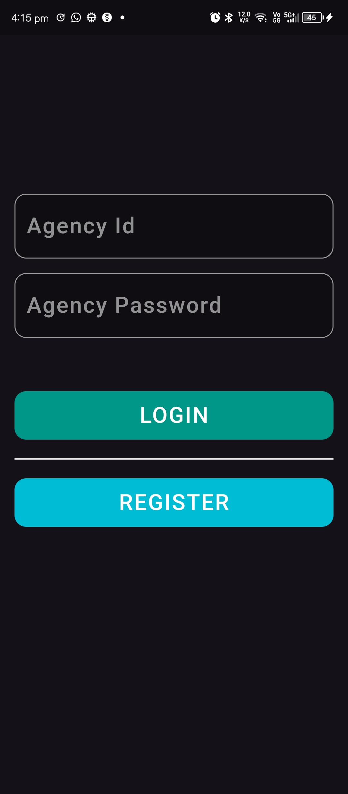
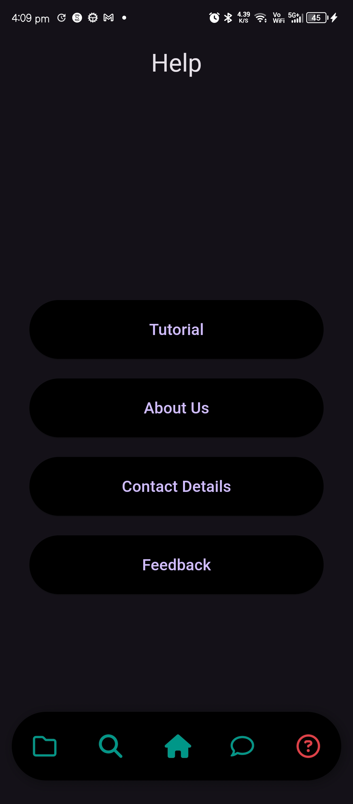

# Smart India Hackathon - Rescue Coordination Application

## Overview

This Flutter application is designed to help rescue agencies coordinate their efforts during disasters. The app centralizes information, displays it on an interactive map, and provides communication tools to enhance collaboration between different rescue agencies.

## Features

- **Interactive Map Interface:** Real-time visualization of rescue agencies and disaster zones
- **Agency Management:** Register and manage rescue agencies with detailed profiles
- **Resource Tracking:** Monitor and allocate resources during rescue operations
- **Real-time Communication:** Integrated chat and alert system for agencies
- **Disaster Zone Management:** Mark and manage disaster-affected areas
- **Cross-platform Support:** Works on Android, iOS, and Web platforms

## Screenshots

### Home Page


### Login Page


### Help Page


## Getting Started

### Prerequisites

- Flutter SDK (latest stable version)
- Dart SDK (latest stable version)
- Android Studio / VS Code with Flutter extensions
- Git
- Firebase account (for backend services)

### Installation

1. **Clone the Repository:**
   ```bash
   git clone https://github.com/your-username/Smart-India-Hackathon-2023.git
   cd Smart-India-Hackathon-2023
   ```

2. **Install Dependencies:**
   ```bash
   flutter pub get
   ```

3. **Configure Firebase:**
   - Create a new Firebase project
   - Add your Android/iOS/Web apps in Firebase console
   - Download and add the configuration files
   - Update `firebase_options.dart` with your configuration

4. **Run the App:**
   ```bash
   flutter run
   ```

### Project Structure

```
lib/
├── commons/         # Common utilities and constants
├── pages/          # Main application screens
├── services/       # Backend services and API integrations
├── main.dart       # Application entry point
└── firebase_options.dart  # Firebase configuration
```

## Development

### Architecture

The application follows a clean architecture pattern with:
- Separation of concerns
- Modular design
- Service-based backend integration
- State management using Provider/Bloc

### Key Technologies

- Flutter for cross-platform development
- Firebase for backend services
- Google Maps for location services
- Provider/Bloc for state management

## Contributing

We welcome contributions to improve the application. Please follow these steps:

1. Fork the repository
2. Create a feature branch (`git checkout -b feature/AmazingFeature`)
3. Commit your changes (`git commit -m 'Add AmazingFeature'`)
4. Push to the branch (`git push origin feature/AmazingFeature`)
5. Open a Pull Request

### Code Style

- Follow the official [Dart style guide](https://dart.dev/guides/language/effective-dart/style)
- Use meaningful variable and function names
- Add comments for complex logic
- Write unit tests for new features

## License

This project is licensed under the MIT License - see the LICENSE file for details.

## Acknowledgments

- Smart India Hackathon 2023
- Flutter Team
- Firebase Team
- All contributors and supporters

## Contact

For any queries or support, please reach out to:
- Project Maintainer: [Your Name]
- Email: [Your Email]
- GitHub: [Your GitHub Profile]
